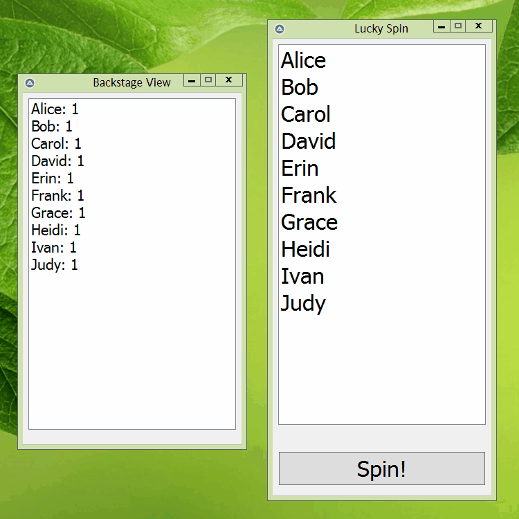

# Random List Spinner

_A random option selector, presented on a list-based GUI._

_© 2017–2023 T.D. Stoneheart. All rights reserved. Source code available under MIT license._

-----

## Introduction

The script was initially used in a classroom to give random presents to students using an on-screen spinner (hence the `giftspin.au3` script file name). A backstage view that can be placed on a different monitor is provided to track the number of remaining selectable options.

At the time of implementation in 2017, the script was quickly and simply made, and hermetic (i.e. no external dependencies). Therefore all configurations had to be written inside the script itself.

Multiple occurrences of a selection is possible via specifying the quantity.

-----

## How to use

Customize values within the `#Region Customization` region, and then run the script with AutoIt3.

To quit, close the Backstage View window. Closing the "Lucky Spin" window has no effect.

-----
